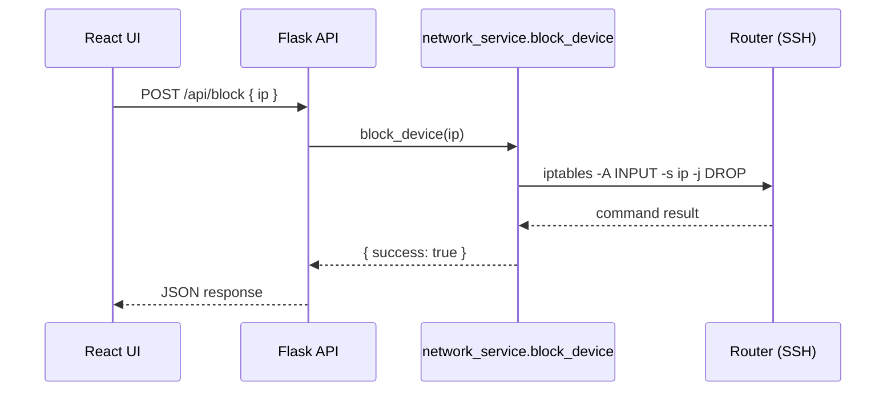

# NetPilot – Project Architecture Documentation

## 1. High-Level Overview

NetPilot is a full-stack application aimed at monitoring and controlling home/SMB networks that are managed by an OpenWrt-based router.  It consists of:

* **Backend** – Python 3 + Flask REST API that talks to the router through SSH and manages local data in TinyDB.
* **Frontend** – React 18 single-page application (built with Vite) that consumes the REST endpoints and offers a dashboard for network visibility and control.
* **Data / Configuration** – human-readable JSON & TinyDB files stored under the `data/` folder to persist modes, lists, rates, etc.

```mermaid
flowchart TD
    subgraph Frontend (React SPA)
        A[UI Pages / Components]
    end
    subgraph Browser
        A -->|HTTP (fetch)| B(Flask REST API)
    end
    subgraph Backend (Flask)
        B --> C[Service Layer]
        C --> D[TinyDB  \nand JSON configs]
        C --> E[SSHClientManager  \n(paramiko)]
        E -->|SSH| F[OpenWrt Router]
    end
```

---

## 2. Connectivity to the Router

| Concern | Implementation |
|---------|----------------|
| **Protocol** | Password-based SSH  (handled via `paramiko`). |
| **Entry point** | `backend/utils/ssh_client.py` defines a singleton `SSHClientManager` which loads credentials from `data/.env` and maintains a persistent connection. |
| **Typical commands** | • `uci` for Wi-Fi & config  • `iptables` and `tc` for traffic shaping  • `ip neigh`, `arp` & log reads for device discovery  • Custom shell helpers in `services/` such as `wifi_management.py`, `block_ip.py`, `reset_rules.py`. |
| **Scanning** | Two strategies: 1. Local ARP scan (`services/network_scanner.py`, Scapy) 2. Router-side scan (`services/router_scanner.py`) which parses DHCP leases + ARP tables over SSH. |
| **Clean-up** | When the Flask app shuts down, `server.py` triggers `ssh_manager.close_connection()` via `atexit`. |

## 3. Backend Server Setup

1. **Application entry** – `backend/server.py`
   * Loads environment variables from `data/.env` (e.g., `SERVER_PORT`, router creds).
   * Instantiates Flask and enables permissive CORS (`CORS(app, resources={r"/*": {"origins": "*"}})`).
   * Initializes TinyDB tables via `db/schema_initializer.py`.
   * Registers blueprints:
     * `endpoints/health.py` → `/health`
     * `endpoints/config.py` → `/config/...`
     * `endpoints/api.py`    → `/api/...` (network ops)
     * `endpoints/wifi.py`   → `/wifi/...`
     * `endpoints/whitelist.py` → `/whitelist/...`
     * `endpoints/blacklist.py` → `/blacklist/...`
     * `endpoints/db.py`      → `/db/...`
   * On exit cleans: SSH + TinyDB flush.

2. **Service layer** – `backend/services/*`
   * Encapsulates domain logic (blocking, scanning, speed-test, whitelist mode, etc.).
   * Each service returns uniform dicts through `utils/response_helpers.py`.

3. **Persistence**
   * TinyDB JSON files (e.g., `data/devices.db`) accessed via `db/tinydb_client.py` and repository helpers (`db/device_repository.py`, `blacklist_management.py`, `whitelist_management.py`).
   * Static configuration JSON under `data/` (e.g., `mode.json`, `bandwidth_mode.json`).

4. **Logging** – `utils/logging_config.py` writes rotating logs to `backend/logs/` (see `error.log`, `whitelist.log`, etc.).

## 4. Frontend

* Located in `frontend/dashboard` (Vite + React 18).
* Component hierarchy:
  * Pages (`src/UI/Pages/*`) – Dashboard, Control, Scan, About, FAQ, etc.
  * Shared components (Header, Sidebar, DeviceCard, etc.).
* State persistence with `localStorage` for scan cache, mode selection, speed-test results.
* Styling via Tailwind / custom CSS modules.
* Build pipeline: `npm run dev` (Vite), `npm run build` outputs to `dist/`.

## 5. Communication Between Front- & Back-End

| Aspect | Details |
|--------|---------|
| **Transport** | HTTP/1.1 with JSON payloads (no WebSockets). |
| **Base URL** | Front-end hard-codes `http://localhost:5000` (see multiple `fetch(...)` calls). |
| **CORS** | Open to all origins; configured in Flask. |
| **Data Contract** | Unified structure `{ success: bool, message?: str, data?: any }` provided by `utils/response_helpers.py`. |
| **Typical flows** |
| • ControlPage → `/whitelist`, `/blacklist`, `/.../activate` to toggle modes. |
| • ScanPage   → `/api/scan/router` to list active devices. |
| • DeviceCard → `/api/block` or `/api/unblock` per device. |
| **Error handling** | Frontend checks `response.ok` and `result.success`, logging to console and updating UI state. |

## 6. Sequence Example – Blocking a Device



## 7. Deployment & Runtime Expectations

* **Backend**: `python backend/server.py` (requires packages in `backend/requirements.txt`).
* **Frontend**: `npm install && npm run dev` inside `frontend/dashboard`.
* **Router prerequisites**: OpenWrt reachable via SSH on default port 22, credentials present in `data/.env`:
  ```ini
  ROUTER_IP=192.168.1.1
  ROUTER_USERNAME=root
  ROUTER_PASSWORD=****
  SERVER_PORT=5000
  ```
* **Logs** live under `backend/logs/` and rotate on app restart.

---
 